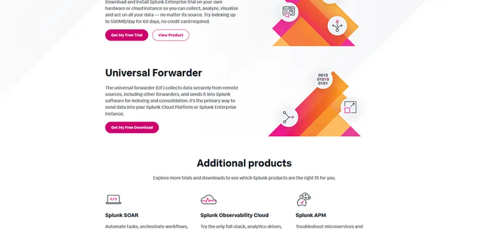
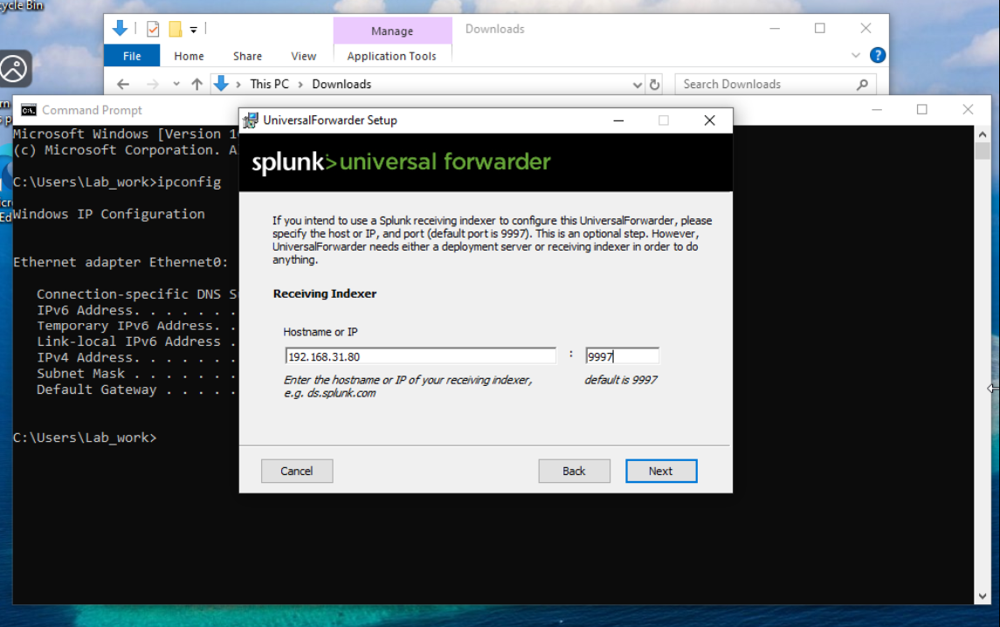
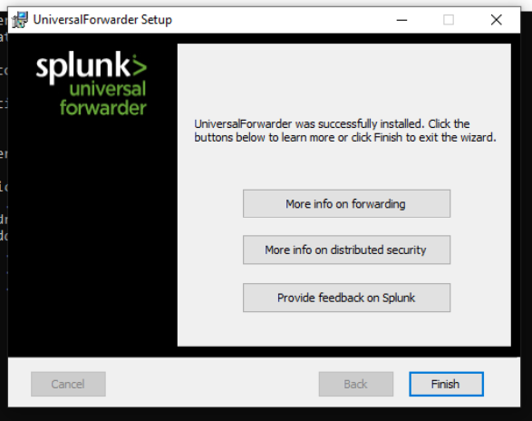

# Setting Up Splunk & Universal Forwarderon on Windows 10 & Linux

## Windows 10
#### Step 1: Downloading the Universal Forwarder
The Splunk Universal Forwarder can be downloaded from the official Splunk download page.


https://www.splunk.com/en_us/download.html

This software will send the log data from a system to your Splunk instance.

#### Step 2: Installing the Universal Forwarder
Run the Installer file.


#### Step 3: Configure the Forwader
  1. License Agreement: Accept the license agreement.
  
  
  2. Create Login Credintials.
  
  
  3. Deployment Server: You can set a the deployment Server if you have one. Or can skip like me.
  
  
  4. Listener Configuration: Specify the IP address of Splunk Enterprise instance (on Window 11 host). Also ensure that listener is set on port 9997.
  
  
#### Click Install to begin installation.


#### After Installation finish the process.


### ✅ Windows Logs Configuration 
Methods to enable log collection:

### 🟢 Configure inputs.conf
#### Step 1: Go to this folder
```
C:\Program Files\SplunkUniversalForwarder\etc\system\local\
```
If inputs.conf does not exist → create it.

#### Step 2: Add This Configuration
```
[WinEventLog://Security]
disabled = 0
index = windows

[WinEventLog://System]
disabled = 0
index = windows

[WinEventLog://Application]
disabled = 0
index = windows
```
Step 3: Restart Forwarder

Open PowerShell as Admin:
```
Restart-Service SplunkForwarder
```
Step 4: Verify in Splunk
```
index=windows host="Windows10"
```
If logs appear → working ✅
