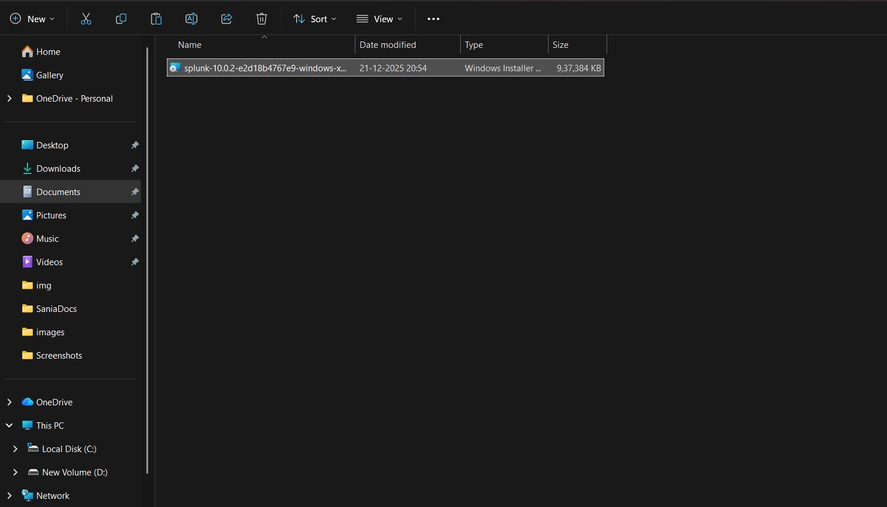
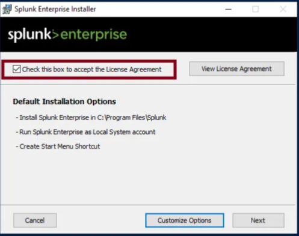
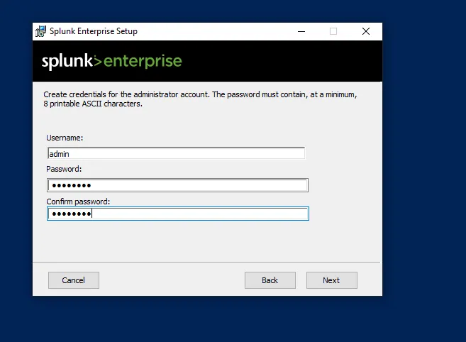
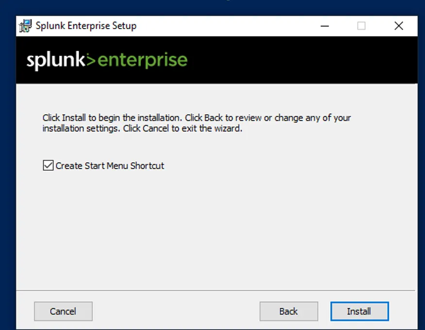
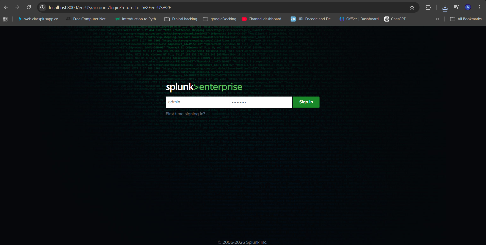
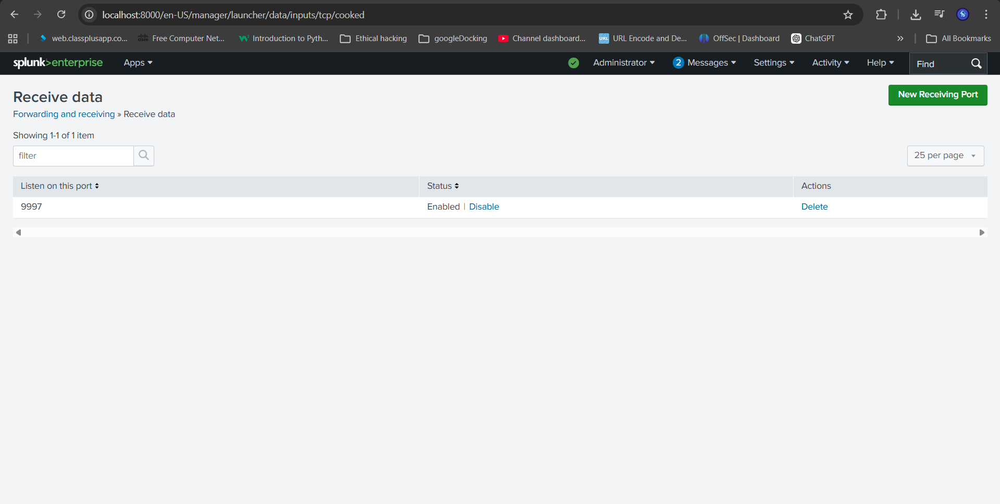

# 🖥️ Splunk Enterprise Setup – Windows 11 Host

---

# ✅ Step 1️⃣ Download Splunk Enterprise

Go to Splunk official website
Download **Windows 64-bit MSI installer**


* Splunk download page
* Selected Windows 64-bit version

---

# ✅ Step 2️⃣ Run Installer

Double-click the `.msi` file.

You will see the setup wizard.



---

# ✅ Step 3️⃣ Accept License

Check:

```
I accept the license agreement
```

Click Next.



* License agreement page

---

# ✅ Step 4️⃣ Set Admin Username & Password

You must create:

```
Username: admin
Password: StrongPassword123!
```

⚠️ Use strong password.



* Admin credential setup page (blur password)

---

# ✅ Step 5️⃣ Install

Click Install.

Wait 2–5 minutes.



---

# ✅ Step 6️⃣ Launch Splunk Web

After installation, open browser:

```text
http://localhost:8000
```

Login with:

* Username: admin
* Password: (your password)



* Splunk login page

Save as:

---

# ✅ Step 7️⃣ Enable Receiving Port (9997)

In Splunk Web:

```
Settings → Forwarding and Receiving → Configure Receiving
```

Click:

```
Add New
```

Set:

```
Port: 9997
```



* Receiving port configuration popup

Save as:

---

# ✅ Step 8️⃣ Verify Installation Using SPL

Go to Search & Reporting app.

Run:

```spl
index=_internal
```

If logs appear → Splunk working ✅


* Search results page


